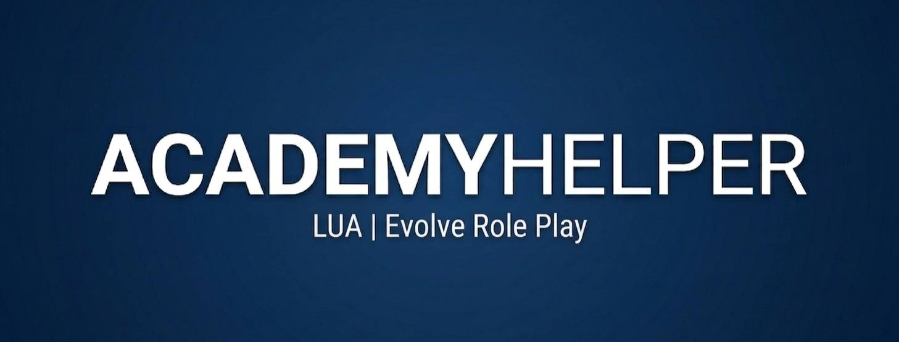

  

# 👮 AcademyHelper `v0.9.9 (Beta)`

---

**Автор:** *Newwer Hasegawa* **Статус проекта:** *Активное Beta-тестирование*.
> [!IMPORTANT]
> В настоящее время идет тест на использование скрипта несколькими игроками одновременно.

---

> [!IMPORTANT]
> Скрипт работает только на проекте **Evolve Role Play**, фракция **LVPD**.

**AcademyHelper** — это система автоматизации для инструкторов и руководства полицейских департаментов. Скрипт позволяет полностью отказаться от ручного управления Google Таблицами, объединяя игровой процесс и базу данных в единую живую экосистему.

---

### 📺 Видеообзор функционала
Для быстрого ознакомления с работой скрипта посмотрите краткую демонстрацию:

👉 **[Смотреть видеообзор скрипта/таблицы/лекций](https://rutube.ru/video/private/f51fbe009ef74da5cb3fcbe7f8f2a509/?p=ygwTU6mdq_iwAXTVAFSDOg)**

👉 **[Смотреть видеообзор скрипта/взаимодействие бота в ВК](https://rutube.ru/video/private/107a87f6168856733c3a534029c97ab0/?p=koEh5wQlm3MOxL2PcKxmDQ)**

---

### 🛠 Установка

| Вариант | Инструкция |
| :--- | :--- |
| 📦 **Полный архив (Все в одном)** | Выберите файл **`AcademyHelper_Full.zip`** в списке выше и нажмите на иконку скачивания (Download raw file). Распакуйте содержимое в папку `moonloader` вашего клиента с заменой. |
| 📄 **Только скрипт (.lua)** | Выберите файл **`AcademyHelper.lua`** в списке выше и скачайте его через кнопку "Download raw file". Закиньте файл в папку `moonloader`. Требуется наличие всех библиотек. |

---

### 📚 Требования и библиотеки

Для корректной работы **AcademyHelper** убедитесь, что в вашей папке `moonloader/lib` присутствуют следующие компоненты:

* **Папки:** `samp` (SAMP.Lua), `game`.
* **Файлы:** `encoding.lua`, `vkeys.lua`, `fAwesome5.lua`.

> [!TIP]
> Если вы скачали **Полный архив**, все необходимые библиотеки уже включены в него.

---

### ⚠️ Статус стабильности (Beta)
На текущем этапе разработки версия **не является полностью стабильной**. Возможны критические ошибки, которые могут привести к:
* **Крашу скрипта** (остановка работы отдельных функций). Для перезапуска нажмите `Ctrl + R`.
* **Крашу всей игры** (вылет на рабочий стол).
* **Полному зависанию игры** (редкая критическая ошибка, при которой поможет только перезагрузка ПК).

**Что делать при ошибке?**
Если у вас произошел сбой, для исправления бага автору необходимы доказательства:
1. **Скриншот окна ошибки**, которое появляется при вылете игры.
2. **Скриншот или текст красного шрифта** из консоли **SAMPFUNCS** (открывается на клавишу `~`).
3. **Отправить информацию автору скрипта** — [https://vk.com/newwer](https://vk.com/newwer)

---

### ✨ Доступные возможности (Beta)

* 📊 **Live-HUD:** Динамический мониторинг кадетов в сети. Цветовая индикация прогресса:
    * `[Л]` - Лекция | `[Т]` - Теория | `[П]` - Практика | `[Д]` - Правило 2-х дней.
    * *Тэги автоматически окрашиваются в зеленый при выполнении условий.*
* 🔄 **P2P Sync:** Мгновенная внутриигровая синхронизация между всеми пользователями скрипта. Зачет, поставленный одним инструктором, сразу отображается у всех. Ведется лог действий, который можно отслеживать.
* 📜 **Логирование действий:** Полная фиксация работы инструкторов в Google Таблице. Теперь можно в любой момент отследить, кто, когда и какое именно действие совершил в базе данных.
* 🤖 **VK-интеграция:** Бот для бесед в ВК. Он автоматически транслирует информацию из игры о проведенных лекциях, практиках и других действиях состава. 👉 **[Ссылка на бота](https://vk.com/academyhelper)**
* 📖 **Global Lecture Bot:** Автоматическое чтение лекций напрямую из репозитория GitHub.
    * **Live-обновление:** При редактировании текста в репозитории, изменения вступают в силу у всех пользователей без переустановки.
    * **Управление:** Пауза/Возобновление клавишей `I`.
* ☁️ **Cloud Integration:** * **Google Forms:** При сдаче теории отметка мгновенно появляется в таблице и в игре (не реализовано - требуется доступ автора к форме).
    * **Auto-Promotion Transfer:** После повышения кадета данные переносятся в основную таблицу LVPD (лист CPD). (не реализовано - требуется доступ автора к таблице).

---

### 🚀 Планы на официальный релиз (v1.0)
*В версии 1.0 проект будет переименован в **FractionManager**. Основные нововведения:*

#### 🛡️ Admin Panel (для рангов 11+)
* **Управление отделами:** Смена отдела (Academy -> CPD -> S.W.A.T) через игровое меню с автоматическим поиском и переносом строки в таблице.
* **Система взысканий:** Выдача выговоров в 2 клика прямо в игре. Скрипт заблокирует повышение игрока при активном выговоре или не пройденном КД.
* **История и логи:** Просмотр прошлых нарушений сотрудника из игры и фиксация ника администратора, внесшего изменения.
* **Admin HUD:** Глобальная статистика (онлайн отделов, готовность кадетов к выпуску).

#### 👤 Self-Info Menu (/myinfo)
Персональный личный кабинет для каждого сотрудника:
* **Кадеты:** Статус обучения и точный таймер до повышения.
* **Офицеры:** Инфо об отделе, активных выговорах и дате следующего ранга.

#### 🤖 Развитие VK-бота
* **Личная статистика:** Возможность через бота смотреть информацию о себе: активные выговоры, срок до повышения, принадлежность к отделу.
* **Мониторинг фракции:** Просмотр актуального онлайна во фракции (members) и получение уведомлений о кадровых изменениях (кто был повышен или понижен).

#### Глобальная автоматизация
* 📑 **Full Automation:** Тотальное логирование всех действий состава.
* ✅ **Smart Eligibility:** Отдельное окно со списком всех игроков, готовых к повышению (авто-проверка экзаменов, выговоров и сроков).

---

### 🎮 Управление и горячие клавиши

> [!CAUTION]
> **Важно:** Пожалуйста, не флудите нажатиями в меню или командой `/updc`. После взаимодействия подождите 2-3 секунды для прогрузки данных или пока отметка в меню не изменит свой цвет. ⏳

| Команда / Клавиша | Описание |
| :--- | :--- |
| `/ah` | Главное меню взаимодействия с Кадетом |
| `/updc` | Принудительное обновление списка из таблицы |
| `/lectures` | Меню выбора и запуска лекций |
| **F5** | Включить / Выключить скрипт |
| **I** | Пауза / Продолжение чтения лекции |
| **Ctrl + R** | Безопасная проверка обновлений лекций и скрипта |
